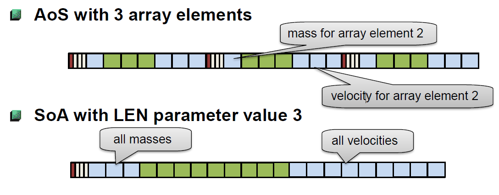

# Memory Layout

## Contents

1. [AoS and SoA Forms](#1)
    1. [Example Transformation](#12)

<a name="1"></a>
# AoS and SoA Forms

## Array of Structures

```fortran
type :: planet
    real :: mass
    real :: pos(3), vel(3)
end type planet

integer, parameter  :: N = 10
type(planet)        :: planets(N)
```
Each object has its own instance and is stored in the array. This is the normal intuitive form.

## Structure of Arrays

```fortran
type :: planets(N)
    integer, len  :: N
    real          :: mass(N)
    real          :: pos(N,3)
    real          :: vel(N,3)
end type planets

integer, parameter :: N = 10
type(planets(N))   :: planet_struct
```

Each field `mass` etc are stored in their own array of contiguous memory.

Example Image:

<center>
    
</center>

From lrz_course.

<br></br>
<a name="12"></a>
# Example Transformation

SoA can allow for easy vectorisation and memory access resulting in faster code. In the example in [extras](../extras/) the momentum for 1,000,000 planets with default masses and velocities is calculated. First with an [Array of Structures - AoS](../extras/mem_layout_AoS.f90) then with a [Structure of Arrays - SoA](../extras/mem_layout_SoA.f90) which is optimised to keep each planets velocity components in one column since Fortran stores matrices column-wise. The SoA version is roughly 5 times faster than the AoS code (compiled with gfortran).

## Links
- AoS and SoA, [Wikipedia](https://en.wikipedia.org/wiki/AoS_and_SoA)
- Putting your Data and Code in Order, [Intel](https://www.intel.com/content/www/us/en/developer/articles/training/putting-your-data-and-code-in-order-data-and-layout-part-2.html)
- Memory Layout Transformations, [Intel](https://www.intel.com/content/www/us/en/developer/articles/technical/memory-layout-transformations.html)