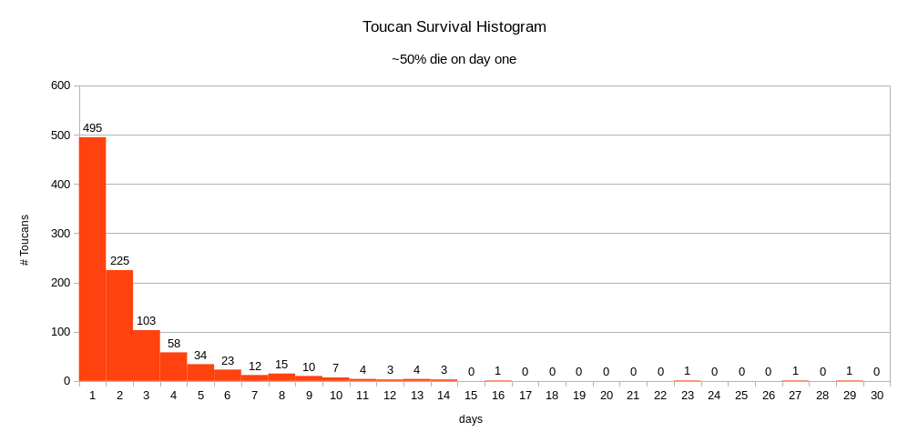

# ex2

Instructions [here](../README.md).

Only need 1 bird to make a chick.    
Food is carried over each day if there is a surplus.     
Survival stats for Toucans:

    

# bird_genus_class

Contains class `bird_genus`

- Can hatch adult birds (from one adult, don't need two)
- Can test whether chick survies to adulthood
- Can make bird forage for food
- Overloaded assignment

# toucan_species_class

Contains class `toucan`

- Hatch, Fledge (survive to adulthood), etc for Toucan
- Special forage, dies if doesn't eat enough food - random

Possible food options are hardcoded into class      
Must match user supplied `diet_food`